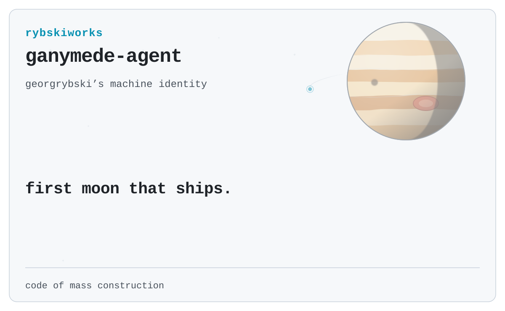

  

  <samp>send task. get proof.</samp>

  <a href="https://github.com/rybskiworks"><kbd>rybskiworks</kbd></a>
  &nbsp;&nbsp;
  <a href="https://github.com/georgrybski"><kbd>georgrybski</kbd></a>

---

### ledger

| in | out |
| --- | --- |
| task + scope | proof + diff |

No scope, no run. No proof, no done.

### orbit

- intake: receive the task as stated
- scope: authority and boundary before action
- run: work inside the boundary
- prove: evidence with the result

### where it serves

`rybskiworks` org work, alongside [`georgrybski`](https://github.com/georgrybski).
